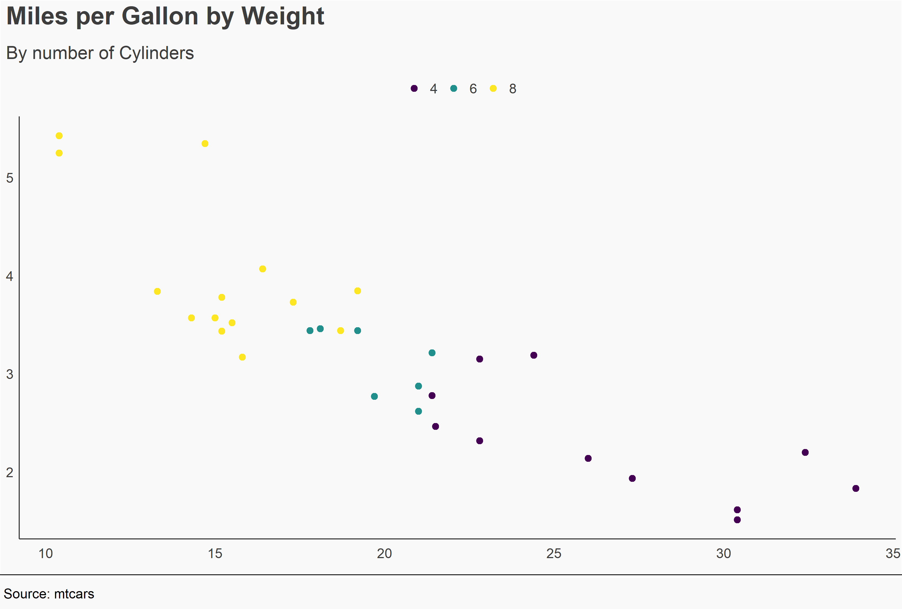

# ACHDSggTheme

## Overview
ACHDSggTheme is an R package for easily adding a standardised Aberdeen Centre for Health Data Science 'theme' to ggplot2 plots in R.

The idea is to build and develop a distinctive and coherent ACHDS style when sharing our findings.

It is based on the [BBC theme package](https://github.com/bbc/bbplot) `{bbplot}` and provides two main functions:

- `theme_achds()` which alters the theme elements
- `finalise_plot()` which adds a footer with the data source & an optional logo. This also saves the plot to a specified destination.

## Installation

``` r
# The easiest way to get ACHHDSggTheme is to install is directly from github

# install.packages("devtools")
devtools::install_github("will-ball/ACHDSggTheme")
```

## Usage

After building your `ggplot()` call you simply add another line and call `theme_achds()` at the end. You then call `finalise_plot()` to save and add footer details.

Here's an example using the `mtcars` dataset.

``` r
plot <- mtcars %>%
  mutate(cyl = ordered(cyl, levels = c("4","6","8"))) %>% 
  ggplot(aes(x = mpg, y = wt, colour = cyl)) + 
  geom_point(size = 2.5) +
  labs(
    title = element_text("Miles per Gallon by Weight"), 
    subtitle = "By number of Cylinders") +
  theme_achds() +
  viridis::scale_colour_viridis(discrete = T)

plot

ACHDSggTheme::finalise_plot(plot = plot, source_name = "Source: mtcars", save_filepath = "test.png")
```


## Development

This version is a proof of concept for a future theme package for ACHDS. Any element of the theming can be altered in future.

Things that could be added later on:

- Additional fonts
- An ACHDS colour palette and functions to apply these to plots
- ?
